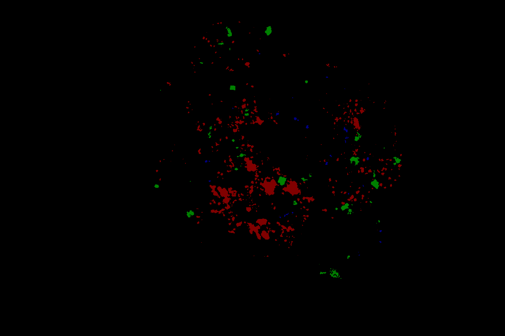
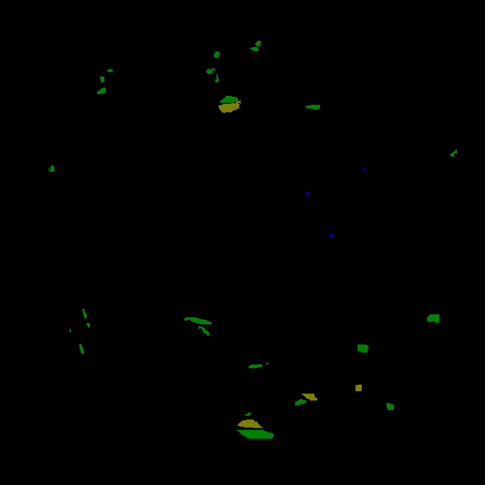

DDR是一个语义分割数据集。由眼底图像，其中训练集包括383张，验证集todo张，测试集todo张有为1：1，2：3，3：4等几种尺度。

该数据集标注了4种病灶：微血管瘤microaneurysms (MA), 出血haemorrhages (HE), 软性渗出soft exudates(SE)，硬性渗出hard exudates (EX)。

- 微血管瘤是最早可见的糖尿病视网膜病变，在显微镜表现下为边界清楚的红色或者暗红的斑点，
- 出血是位于视网膜是较大的斑，呈条状或者火焰状，
- 软性渗出常发生在糖尿病视网膜病变早期，为白色絮状斑块，
- 硬性渗出为境界清晰的辣样黄色斑点或斑块，可数个或者成堆出现。

标签为像素级标注的png格式图像，各种颜色对应的标签如下

* 蓝色：MA
* 绿色：HE
* 黄色：SE
* 红色：EX

