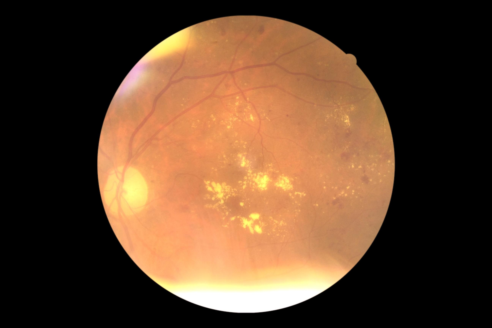
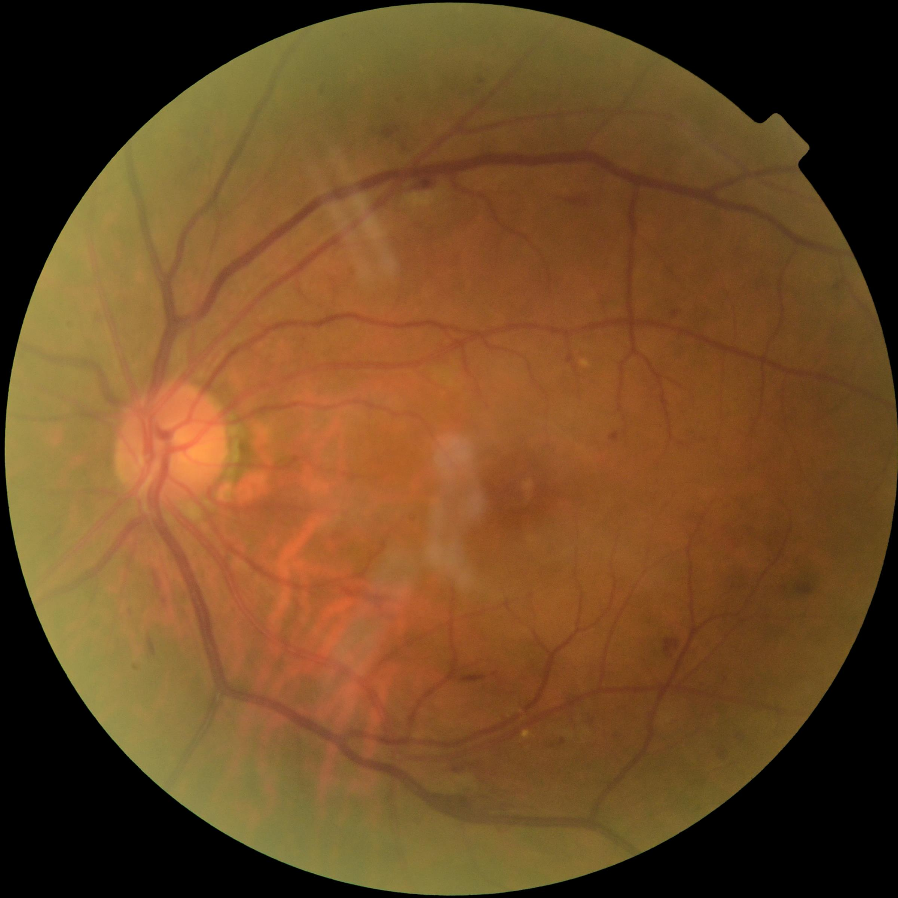

## 简介

DDR和IDRiD都是语义分割数据集，两个数据集均是眼底图像组成。

DDR由712张眼底图像组成，其中训练集包括383张，验证集149张，测试集225张。图像的分辨率不一，大多数为(1728, 2592)、(1536, 2048)；图像的长宽比不一， 有1：1，2：3，3：4等几种尺度。

|    DDR       | 训练集     | 测试集     |
| ------------ | ---------- | ---------- |
| 图像数量     | 383        | 225        |
| 总面积       | 1920757184 | 1166007444 |
| 总病灶个数   | 25339      | 17439      |
| 总病灶面积   | 10699880   | 10139750   |
| 病灶面积占比 | 0.00557    | 0.00870    |

IDRiD由81张眼底图像组成，其中训练集包括54张、测试集27张，图像的分辨率均为(4288,2848)。

|    IDRiD     | 训练集     | 测试集     |
| ------------ | ---------- | ---------- |
| 图像数量     | 354        | 27        |
| 总病灶个数   | 11470      | 5802      |
| 总病灶面积   | 13771781   | 8012441   |
| 病灶面积占比 | 0.02088    | 0.02430    |

\* 面积=像素个数

## 图像

该数据集标注了4种病灶：微血管瘤microaneurysms (MA), 出血haemorrhages (HE), 软性渗出soft exudates(SE)，硬性渗出hard exudates (EX)。

- 微血管瘤是最早可见的糖尿病视网膜病变，在显微镜表现下为边界清楚的红色或者暗红的斑点，
- 出血是位于视网膜是较大的斑，呈条状或者火焰状，
- 软性渗出常发生在糖尿病视网膜病变早期，为白色絮状斑块，
- 硬性渗出为境界清晰的辣样黄色斑点或斑块，可数个或者成堆出现。

## 标签

标签为像素级标注的png格式图像，各种颜色对应的病灶如下

* 蓝色：MA
* 绿色：HE
* 黄色：SE
* 红色：EX

## 难点

这两个数据集的难点：

1、小目标多

| 面积位于区间段的病灶个数 | EX   | HE   | SE   | MA   | 总计  |
| ------------------------ | ---- | ---- | ---- | ---- | ----- |
| (0, 100]                 | 9012 | 1301 | 245  | 4595 | 15153 |
| (100, 1000]              | 4165 | 2822 | 215  | 1295 | 8497  |
| (1000, ∞]                | 542  | 838  | 306  | 3    | 1689  |

如上表所示，约60%的病灶面积小于100。

2、样本不平衡

|                  | EX      | HE      | SE      | MA     | 总计        |
| ---------------- | ------- | ------- | ------- | ------ | ----------- |
| 病灶个数         | 13719   | 4961    | 766     | 5893   | 25399       |
| 病灶面积         | 3373070 | 5795715 | 1088080 | 443015 | 10699880.00 |
| 平均每个病灶面积 | 245.87  | 1168.26 | 1420.47 | 75.18  | 421.27      |

如上表所示，EX个数是SE的20倍，HE的平均面积是MA的15倍。

\* 两张表均为DDR训练集的统计数据

## 图例

下面是DDR数据集中的一张图像和标签`007-3319-200.jpg`

    

下面是DDR数据集中的一张图像和标签`007-3375-200.jpg`

