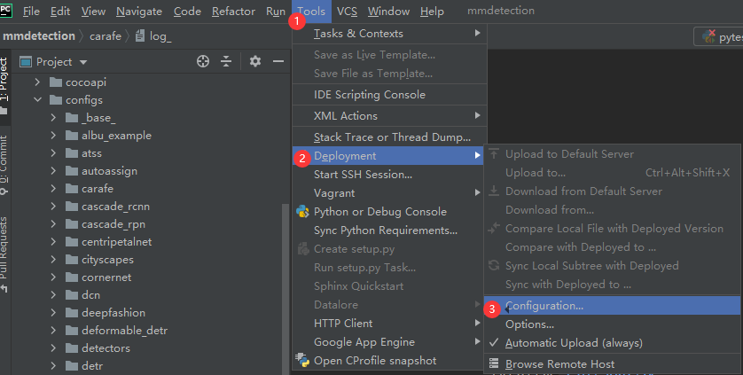
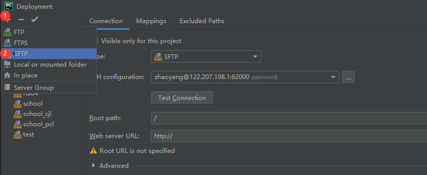
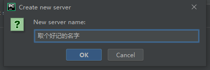
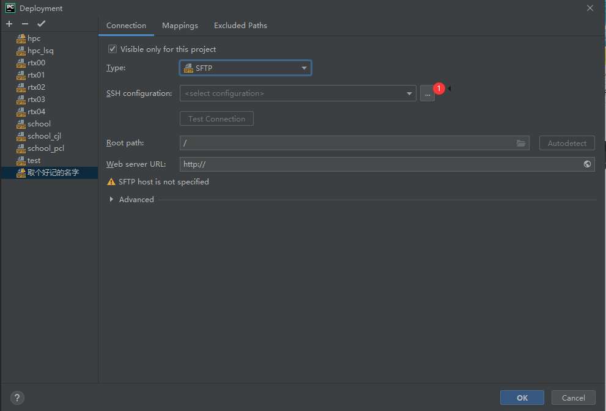
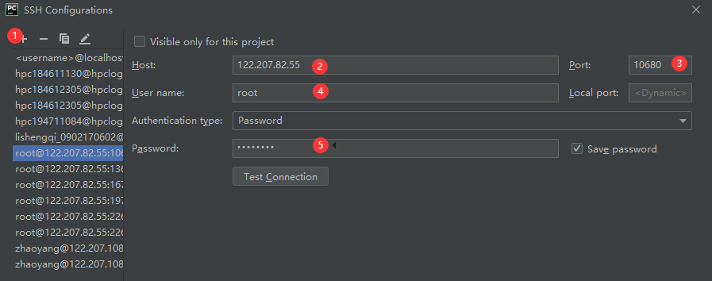
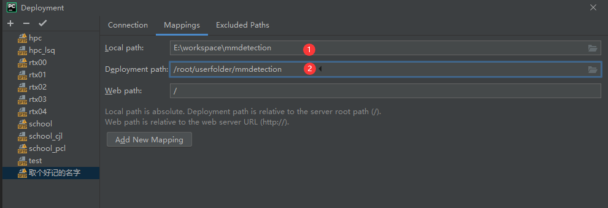
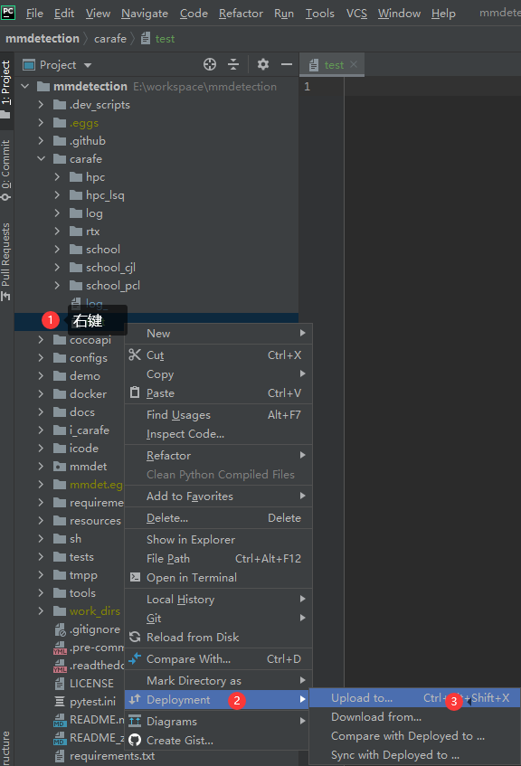
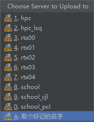

众所周知，直接在服务器上用vim写代码效率低下，本教程提供一种本地写代码，快捷同步到服务器的方法。

## 一. 下载pycharm专业版

1. 下载pycharm专业版
https://www.jetbrains.com/pycharm/download/

2. 用学校邮箱申请学生账号
中南大学邮箱申请地址：https://mail.csu.edu.cn/

3. 用学生账号激活pycharm专业版

## 二、配置服务器

1. 在Tools中依次点击

2. 点"+" -> sftp

3.

4. 点'...'添加ssh, 也可以添加已有的ssh

5. 点"+", 然后填入服务器的配置

6. 填入本地项目路径 和 对应的服务器上的路径

## 同步文件到服务器

1. 右键文件或文件夹

2. 选择要上传的服务器

